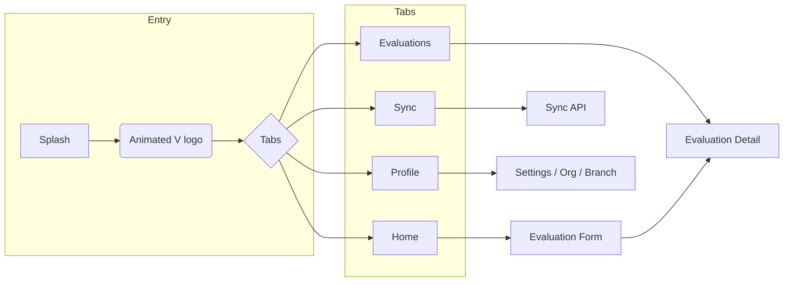

<p align="center">
  
</p>

# Mr. Valuator

**Property valuation, on the go.** A modern Expo (React Native) app for field evaluators: capture property location on a map, fill a step-by-step valuation form, attach photos & documents, and sync with your backend. Built for Nepal with **GalliMaps** and **MapLibre**.

---

## ✨ Highlights

| | |
|:---:|:---|
|  | **Branded experience** — Custom app icon, splash screen, and an **animated SVG logo** on launch. |
| 🗺️ | **Map-first location** — Center-pin UX: move the map, pin stays fixed; tap to recenter. Property evaluation data (ward, heritage, flood/landslide, water, power) auto-fetched from GalliMaps. |
| 📋 | **Multi-step form** — Property details, documents, pricing, and risk factors with validation and drafts. |
| 📷 | **Photos & docs** — Camera capture, gallery picker, and optional PDF export. |
| 🔐 | **Auth** — Better Auth + Expo SecureStore; login, register, forgot/reset password, optional biometrics. |
| ☁️ | **Sync** — Offline-first SQLite; sync evaluations to your API with conflict handling. |

---

## 🖼️ App identity & splash

| Asset | Description |
|-------|-------------|
| **App icon** | Used on home screen and in stores. Stored at `assets/images/app_icon.jpeg` and `assets/valuator.icon/Assets/app_icon.jpeg` for adaptive Android icon. |
| **Splash screen** | Static image shown while the app boots (`assets/images/splash.png`). |
| **Animated splash** | After the native splash hides, an **onboarding animation** runs: the **Valuation “V” logo** is drawn with SVG paths using **React Native Reanimated** (staggered stroke animation, then fade out). See `components/AnimatedSplashScreen.tsx`. |
| **Auth logo** | X-shaped logo with checkmark used on login/register/forgot-password screens (`features/auth/components/AuthLogo.tsx`). |
| **Valuation V icon** | Small “V” SVG used in headers and branding (`components/ValuationVIcon.tsx`). |

<p align="center">
  
</p>

---

## 🎬 Animations (current & ideas)

- **Current**
  - **Animated splash** — SVG “V” logo drawn with Reanimated (`strokeDashoffset`), then fade out.
  - **FAB** — Evaluation FAB with expand/collapse for quick actions (Home, Settings, Converter, Sync, New form).
  - **Theme & transitions** — React Native Paper theming; safe-area and layout transitions via expo-router.

- **Ideas you can add**
  - **List animations** — Animate list items on Evaluations/Sync screens (e.g. Reanimated `entering`/`exiting` or `Layout` animations).
  - **Map pin** — Subtle scale or bounce when the map stops moving after pan.
  - **Step form** — Slide or fade when moving between steps (e.g. `Animated` or Reanimated `shared value` for step index).
  - **Success states** — After sync or submit: checkmark Lottie or a short Reanimated sequence.
  - **Skeleton loaders** — For evaluation list and profile using Reanimated or a small skeleton component.

---

## 🚀 Tech stack

| Layer | Tech |
|-------|------|
| **Framework** | **Expo** (SDK 54), **React Native**, **expo-router** (file-based routing) |
| **UI** | **React Native Paper**, **Tamagui** (config/themes), **expo-linear-gradient** |
| **Maps** | **@maplibre/maplibre-react-native**, **GalliMaps** (tiles, search, reverse geocode, property evaluation API) |
| **Forms** | **react-hook-form**, **@hookform/resolvers**, **Zod** |
| **Auth** | **Better Auth** (Expo client), **Expo SecureStore**, optional **expo-local-authentication** |
| **Data** | **expo-sqlite** (local DB), **Zustand** (auth/session), **TanStack Query** (optional server state) |
| **Media** | **expo-camera**, **expo-image-picker**, **expo-file-system**, **expo-print** (PDF) |
| **Location** | **expo-location** |
| **Animation** | **react-native-reanimated**, **react-native-gesture-handler** |
| **Other** | TypeScript, **Flash List**, **Burnt** (toast), **axios** |

---

## 📂 Project structure

```text
.
├── app/
│   ├── (auth)/                    # Auth routes (no session required)
│   │   ├── _layout.tsx
│   │   ├── login.tsx
│   │   ├── register.tsx
│   │   ├── forgot-password.tsx
│   │   └── reset-password.tsx
│   │
│   ├── (tabs)/                    # Main tab navigator
│   │   ├── _layout.tsx             # Tabs + custom TabBar
│   │   ├── home.tsx                # Dashboard, recent valuations, presence
│   │   ├── evaluations.tsx        # List/filter evaluations
│   │   ├── sync.tsx                # Sync status & queue
│   │   └── profile.tsx             # User / org / branch / guest
│   │
│   ├── (pages)/                    # Stack screens (form, detail, settings, tools)
│   │   ├── _layout.tsx
│   │   ├── EvaluationForm.tsx      # Multi-step property valuation form
│   │   ├── EvaluationDetail.tsx   # View/edit single evaluation
│   │   ├── Settings.tsx
│   │   └── NepalUnitConverter.tsx
│   │
│   ├── _layout.tsx                 # Root layout, fonts, splash, toast
│   ├── index.tsx                  # Redirect to /(tabs)/home
│   └── +not-found.tsx
│
├── components/
│   ├── AnimatedSplashScreen.tsx    # Animated “V” logo splash
│   ├── ValuationVIcon.tsx         # Small V logo SVG
│   ├── TabBar.tsx
│   ├── MenuDrawer.tsx
│   ├── EvaliationFAB.tsx           # FAB with quick actions
│   ├── evaluation-form/            # Step0 (map) … Step5
│   ├── profile/                    # UserProfile, OrganizationDetails, etc.
│   ├── nepal-unit-converter/
│   └── ui/                         # Form inputs, toggles, date picker, etc.
│
├── features/
│   └── auth/
│       └── components/             # AuthLogo, ForgotPasswordStep*, OTPStep
│
├── lib/
│   ├── auth-store.ts              # Zustand + Better Auth Expo client
│   ├── schema.ts                  # SQLite schema, valuations CRUD
│   ├── property-evaluation-api.ts # GalliMaps property evaluation
│   ├── sync/                      # Sync manager, API client
│   └── ...
│
├── constants/
│   └── form-schema.ts             # Valuation form schema & Zod
│
├── assets/
│   ├── images/
│   │   ├── app_icon.jpeg
│   │   ├── splash.png
│   │   ├── favicon.png
│   │   └── ...
│   ├── valuator.icon/             # Adaptive icon assets
│   └── fonts/
│
├── app.config.ts                  # Expo config (name, MapLibre plugin, etc.)
├── app.json                       # Expo app.json (icon, splash, plugins)
└── package.json
```

---

## 🗺️ App flow (high level)



---

## 🛠️ Getting started

**Requirements:** Node 18+, pnpm (or npm/yarn), Expo CLI, iOS Simulator / Android emulator or device.

1. **Clone and install**
   ```bash
   cd Evaluation_Mobile_App
   pnpm install
   ```

2. **Environment**
   - Copy any `.env.example` to `.env` and set:
     - `EXPO_PUBLIC_GALLI_MAPS_API_KEY` (or `GALLI_MAPS_API_KEY`) for GalliMaps tiles, search, and property evaluation API.
   - Configure Better Auth backend URL and keys if you use auth/sync.

3. **Run**
   ```bash
   pnpm start
   ```
   Then press `i` for iOS or `a` for Android. For a dev client build:
   ```bash
   pnpm run android
   # or
   pnpm run ios
   ```

4. **Build**
   - Android APK: `pnpm run build:apk`
   - iOS: `pnpm run build:ios` (with Apple setup)

---

## 📄 License & credits

- **GalliMaps** for Nepal-focused map tiles and property evaluation API.
- **MapLibre** for the React Native map component.
- **Expo**, **React Native Paper**, **Better Auth**, and the rest of the open-source stack listed above.

---

<p align="center">
    
  <br />
  <strong>Mr. Valuator</strong> — Property valuation, on the go.
</p>
